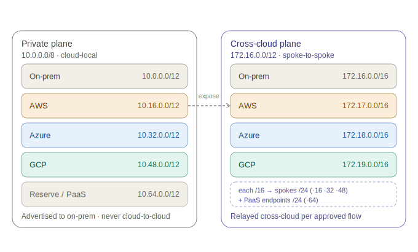

# Network Design

**Status:** Draft v0.1 — derives from [01-architecture-specification.md](01-architecture-specification.md)
**Scope:** Single region per cloud (decision D3), dedicated circuits per provider (D1), hybrid inspection (D2).

---

## 1. Addressing (IPAM)



Strict non-overlapping RFC1918, split into **two planes**:

- **Private plane (`10.0.0.0/8`)** — each site's normal, intra-cloud + on-prem addressing. A `/12`
  per site. These prefixes are reachable from on-prem but are **never advertised cloud-to-cloud**.
- **Cross-cloud plane (`172.16.0.0/12`)** — a separate range per site holding only the subnets whose
  workloads are *approved to participate in cross-cloud (spoke-to-spoke) flows*. All cross-cloud
  routes and firewall rules reference this plane only, so exposure is explicit and the broad private
  `10/12` space stays cloud-local.

A workload that only talks intra-cloud / to on-prem lives in the `10` plane. A workload that must be
reachable from another cloud gets an interface (or sits) in the site's `172` cross-cloud range.

The same rule applies to **PaaS / private endpoints** (PrivateLink / Private Endpoint / PSC):

- An endpoint consumed **only intra-cloud or from on-prem** keeps its private-plane address
  (`10.x.64.0/20`, from the `10.64.0.0/12` reserve).
- An endpoint consumed **across clouds** is placed in the site's cross-cloud PaaS block
  (`172.x.64.0/24`) so its address is reachable over the `172` plane like any other cross-cloud
  resource — and so cross-cloud rules never have to reference the private `10` space.

### 1.1 Private supernets (plane 1)

| Site | Supernet | Addresses | Notes |
|------|----------|-----------|-------|
| On-prem | `10.0.0.0/12` | 10.0–10.15 | Datacenter + colo edge |
| AWS | `10.16.0.0/12` | 10.16–10.31 | eu-west-1 |
| Azure | `10.32.0.0/12` | 10.32–10.47 | West Europe |
| GCP | `10.48.0.0/12` | 10.48–10.63 | europe-west1 |
| Transit / PaaS reserve | `10.64.0.0/12` | 10.64–10.79 | PrivateLink/PE/PSC ranges, future regions |

### 1.2 Cross-cloud supernets (plane 2)

Carved from `172.16.0.0/12`, a `/16` per site. Only cross-cloud-eligible subnets draw from here.

| Site | Cross-cloud block | Per-spoke `/24` (prod · non-prod · shared) | PaaS endpoints `/24` |
|------|-------------------|--------------------------------------------|----------------------|
| On-prem | `172.16.0.0/16` | `172.16.0.0/24` (services exposed cross-cloud) | `172.16.64.0/24` |
| AWS | `172.17.0.0/16` | `172.17.16.0/24` · `172.17.32.0/24` · `172.17.48.0/24` | `172.17.64.0/24` |
| Azure | `172.18.0.0/16` | `172.18.16.0/24` · `172.18.32.0/24` · `172.18.48.0/24` | `172.18.64.0/24` |
| GCP | `172.19.0.0/16` | `172.19.16.0/24` · `172.19.32.0/24` · `172.19.48.0/24` | `172.19.64.0/24` |

The third octet mirrors the private spoke offsets (16/32/48) so the two planes line up per spoke;
the `64` block mirrors the private `10.x.64.0/20` endpoint block. The whole `172.x.0.0/16` is
advertised as one summary, so the PaaS `/24` needs no extra route.

### 1.3 Per-cloud carve (identical pattern across providers)

Using AWS as the worked example; Azure (`10.32` / `172.18`) and GCP (`10.48` / `172.19`) follow the same offsets.

| Block | CIDR (AWS) | Plane | Role |
|-------|-----------|-------|------|
| Cloud hub | `10.16.0.0/20` | private | Connectivity hub (TGW/hub-VNet/Shared-VPC), firewall, DNS, gateways |
| Prod spoke | `10.16.16.0/20` | private | Production workload VPC/VNet |
| Non-prod spoke | `10.16.32.0/20` | private | Dev/test workload VPC/VNet |
| Shared-services spoke | `10.16.48.0/20` | private | Platform services, CI, registries |
| Private-endpoint subnets | `10.16.64.0/20` | private | PrivateLink / Private Endpoint / PSC NICs (intra-cloud / on-prem only) |
| Reserved | `10.16.128.0/17` | private | Future spokes / second AZ expansion |
| Prod cross-cloud subnet | `172.17.16.0/24` | cross-cloud | Prod resources reachable from other clouds |
| Non-prod cross-cloud subnet | `172.17.32.0/24` | cross-cloud | Non-prod cross-cloud exposure |
| Shared cross-cloud subnet | `172.17.48.0/24` | cross-cloud | Shared-services cross-cloud exposure |
| Cross-cloud PaaS endpoints | `172.17.64.0/24` | cross-cloud | PrivateLink/PE/PSC endpoints consumed from other clouds |

Each plane summarizes cleanly: the cloud hub advertises **one private summary** (`10.16.0.0/12`) and
**one cross-cloud summary** (`172.17.0.0/16`) toward on-prem, keeping BGP tables small (Section 3.4).

### 1.4 Subnet layout inside a spoke (example, prod `10.16.16.0/20`)

| Subnet | CIDR | AZ | Purpose |
|--------|------|----|---------|
| app-a | `10.16.16.0/24` | az-1 | Application tier |
| app-b | `10.16.17.0/24` | az-2 | Application tier (HA) |
| data-a | `10.16.18.0/24` | az-1 | Private data tier |
| data-b | `10.16.19.0/24` | az-2 | Private data tier (HA) |
| endpoints | `10.16.20.0/24` | az-1/2 | Interface endpoints into this spoke |

No public subnets exist (constraint C1); there is no IGW / public LB / public IP.

---

## 2. DNS resolution

| Direction | Mechanism |
|-----------|-----------|
| On-prem → cloud private zones | Conditional forwarders → cloud inbound resolver endpoints |
| Cloud → on-prem internal names | Outbound resolver rules → on-prem resolvers |
| Cloud → its own private endpoints | Provider private DNS zone, auto-registered |
| Cross-cloud name resolution | Via on-prem authoritative zone (hub owns the namespace) |

Resolver endpoints live in each **cloud hub** (`10.x.0.0/20`): Route 53 Resolver (AWS), Private DNS
Resolver (Azure), Cloud DNS forwarding (GCP).

---

## 3. Routing & BGP

### 3.1 ASN plan (private ASNs)

| Domain | ASN | Role |
|--------|-----|------|
| On-prem core / colo edge | `65000` | Global hub routing domain (customer side of all circuits) |
| AWS Transit Gateway | `65010` | Amazon-side BGP on Direct Connect transit VIF |
| Azure ExpressRoute | MS-fixed `12076` | Microsoft side; customer gateway peers as `65000` |
| GCP Cloud Router | `65020` | GCP side of Cloud Interconnect VLAN attachment |

### 3.2 eBGP sessions

- **On-prem ↔ AWS:** eBGP `65000 ↔ 65010` over Direct Connect transit VIF (dual, one per circuit).
- **On-prem ↔ Azure:** eBGP `65000 ↔ 12076` over ExpressRoute private peering (primary + secondary).
- **On-prem ↔ GCP:** eBGP `65000 ↔ 65020` over two VLAN attachments (Cloud Router HA, two interfaces).
- **BFD** enabled on every session for sub-second liveness.

### 3.3 Advertisements

Each cloud advertises **two summaries** to on-prem — its private `/12` and its cross-cloud `/16`:

| From | Advertises (private) | Advertises (cross-cloud) | To |
|------|----------------------|--------------------------|----|
| On-prem | `10.0.0.0/12` + optional default-originate | `172.16.0.0/16` | All clouds |
| AWS hub | `10.16.0.0/12` | `172.17.0.0/16` | On-prem |
| Azure hub | `10.32.0.0/12` | `172.18.0.0/16` | On-prem |
| GCP hub | `10.48.0.0/12` | `172.19.0.0/16` | On-prem |

- Clouds advertise **summaries only** — no per-spoke routes leak across the WAN.
- **Private `10/12` summaries are never relayed cloud-to-cloud.** On-prem does not redistribute one
  cloud's private summary to another → no implicit spoke-to-spoke (G3).
- **Cross-cloud reachability uses the `172.16.0.0/12` plane only.** Even there it is not blanket: on-prem
  relays a *specific* approved cross-cloud `/24` (e.g. `172.17.16.0/24`) to the destination cloud per
  approved flow (Section 4). The dedicated plane just scopes every cross-cloud route/rule to `172/12`.

### 3.4 In-cloud route tables (Tier-2)

- **Cloud hub** holds the circuit attachment and the inspection firewall. Its route table sends
  `10.0.0.0/12` (on-prem) and any approved cross-cloud `/24` (from `172.16.0.0/12`) out the circuit,
  and `0.0.0.0/0` to the firewall (default-deny egress).
- **Workload spokes** default-route (`0.0.0.0/0`) to the cloud hub firewall via:
  - AWS: spoke VPC route table → TGW attachment; TGW route table → firewall/inspection VPC.
  - Azure: spoke VNet UDR `0.0.0.0/0` → Azure Firewall private IP in hub VNet (peered).
  - GCP: spoke (service project) routes → NCC / Shared-VPC hub; firewall policy on host VPC.
- Transitive spoke→spoke **inside one cloud** is blocked unless hairpinned through the hub firewall.

---

## 4. East-west (cross-cloud) flows


Cloud-to-cloud traffic is **not** a direct path — there is no spoke-to-spoke and no cloud-to-cloud
peering. An approved flow (e.g. AWS prod → Azure prod) traverses:

```
AWS spoke → AWS hub firewall → Direct Connect → on-prem NGFW
          → ExpressRoute → Azure hub firewall → Azure spoke
```

- Inspected at the **source cloud firewall**, the **on-prem NGFW**, and the **destination cloud
  firewall** (hybrid inspection, D2).
- Both endpoints are **cross-cloud-plane** addresses: AWS prod exposes `172.17.16.0/24`, Azure prod
  exposes `172.18.16.0/24`. The flow is enabled by relaying that specific `/24` + a firewall
  allow-rule on the path — never a blanket route, and never touching the `10/12` private plane.
- Private-only resources (in `10/12`) are unreachable cross-cloud by construction — they are never
  advertised past on-prem, so lateral exposure is impossible without first placing a workload in the
  `172` plane.
- Latency cost is accepted as the trade-off for central control and zero lateral trust.

---

## 5. Resilience

| Layer | Mechanism | Target |
|-------|-----------|--------|
| Circuit | Dual circuits per provider on diverse colo devices/POPs | NFR1 99.9% |
| BGP path | `local-pref` primary, AS-path prepend on secondary; BFD | NFR4 ≤ 15 min (sub-second in practice) |
| Cloud hub | Gateways/firewall across ≥ 2 AZs | AZ-fault tolerant |
| DNS | Redundant resolver endpoints per hub (multi-AZ) | No single resolver SPOF |

### 5.1 Failover behavior

- Primary circuit loss → BGP withdraws, traffic shifts to secondary within BFD detection window.
- Both circuits to one cloud lost → that cloud is isolated (by design — no Internet fallback).
  Monitored and alerted; covered by per-provider dual-POP diversity.

---

## 6. Validation checklist

- [ ] No overlapping CIDR across any site (IPAM authoritative).
- [ ] No public IP / IGW / public PaaS endpoint resolvable anywhere (guardrails, see `04`).
- [ ] Each cloud advertises exactly one summary prefix.
- [ ] On-prem does not transit cloud-A summary to cloud-B by default.
- [ ] Every workload spoke default-routes to its cloud hub firewall.
- [ ] BFD up on all eBGP sessions; failover tested.

---

## 7. Next

- `03-connectivity-buildout.md` — circuit ordering, colo cross-connects, per-provider gateway build.
- `04-security-baseline.md` — SCP / Azure Policy / Org Policy guardrails as code.
