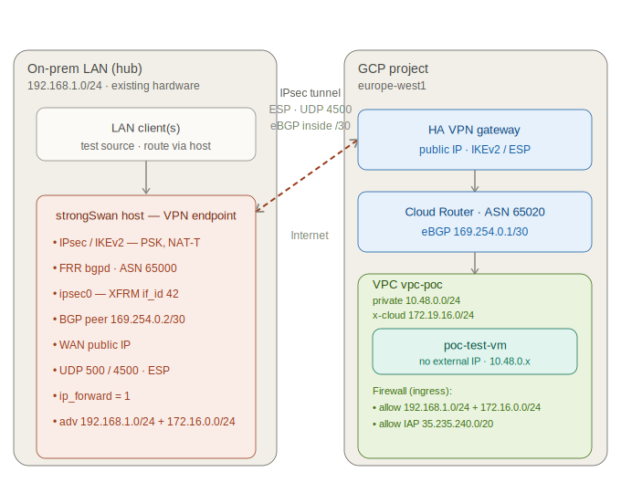
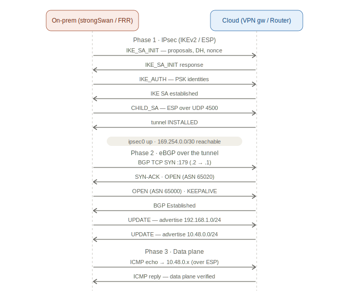

# PoC — LAN-as-on-prem over Site-to-Site VPN (GCP first)

**Status:** PoC v0.1
**Purpose:** Prove the hub-and-spoke pattern end-to-end **cheaply**, using the **local LAN as the
on-prem hub** and an **IPsec VPN over the public Internet** instead of a dedicated circuit.

> This **overrides decision D1** *for the PoC only*. Dedicated Direct Connect / ExpressRoute /
> Cloud Interconnect ([01 §7](01-architecture-specification.md)) are replaced by managed cloud VPN
> gateways + on-prem strongSwan. Everything else — hub-and-spoke, BGP (ASN 65000↔65020), private
> workloads, no public service exposure — is preserved so the PoC validates the real design.

---

## 1. What "no public exposure" means here

The IPsec tunnel runs over the Internet, so **two public IPs are unavoidable**: the GCP HA VPN
gateway and the on-prem WAN IP. These are **tunnel endpoints only**. The actual workloads (the test
VM, any PaaS) keep **no external IP** — they are reachable solely through the encrypted tunnel. That
preserves G2 (no public exposition of *services*); the VPN gateway is the controlled door, like the
circuit termination is in production.

---

## 2. Topology



```
   LAN 192.168.1.0/24                          GCP VPC 10.48.0.0/24 (hub)
 ┌─────────────────────┐    IPsec/IKEv2     ┌────────────────────────────┐
 │  LAN hosts          │    + BGP over      │  Cloud Router (ASN 65020)  │
 │      │              │    169.254.0.0/30  │        │                   │
 │  strongSwan host  ◀─┼════════════════════┼▶  HA VPN gateway           │
 │  (FRR/bgpd)         │   UDP 500/4500     │        │                   │
 │  ASN 65000          │                    │   test VM (no ext IP)      │
 └─────────────────────┘                    └────────────────────────────┘
```

- **On-prem hub** = the LAN; a Linux box runs **strongSwan** (IPsec) + **FRR** (BGP).
- **GCP spoke** = a VPC with **both IPAM planes** ([02 §1](02-network-design.md)) — a private subnet
  `10.48.0.0/24` and a cross-cloud subnet `192.168.50.0/24` — plus the **HA VPN gateway**, **Cloud
  Router**, and a test VM with no external IP.
- **Routing:** BGP over the tunnel (link-local `169.254.0.0/30`). On-prem advertises its LAN
  `192.168.1.0/24`; GCP advertises both its subnets — private `10.48.0.0/24` and cross-cloud
  `192.168.50.0/24`. Both GCP planes are learned and reachable from on-prem.

---

## 3. Addressing & identifiers

| Item | Value (PoC default) | Notes |
|------|--------------------|-------|
| On-prem LAN (private) | `192.168.1.0/24` | Set to your real LAN range |
| GCP private subnet | `10.48.0.0/24` | Private plane, from the GCP `/12` |
| GCP cross-cloud subnet | `192.168.50.0/24` | PoC choice (non-overlapping home-style); prod plan uses `172.19.0.0/16` |
| On-prem ASN | `65000` | Matches prod design |
| GCP Cloud Router ASN | `65020` | Matches prod design |
| BGP link-local (GCP / on-prem) | `169.254.0.1` / `169.254.0.2` | `/30` inside the tunnel |
| IKE | IKEv2, PSK | aes256 · sha256 · DH group 14 (modp2048) |
| ESP | aes256 · sha256 · PFS group 14 | GCP-supported cipher set |

---

## 4. Prerequisites

- A GCP project with billing + the Compute API enabled, and `gcloud` / Terraform creds.
- A Linux host on the LAN with a **reachable public IP**. Since on-prem **initiates** the tunnel
  (`start_action=start`) over NAT-T (UDP 4500), it works through a home router **without inbound
  port-forwarding** — the router's outbound NAT keeps the session open.
- Packages on the strongSwan host: `strongswan-swanctl` (or `strongswan`), `frr`.
- IP forwarding enabled: `net.ipv4.ip_forward=1`.

### 4.1 Dynamic public IP (e.g. Orange Livebox)

GCP's external VPN gateway is pinned to the on-prem **public IP** (there is no FQDN/identity option —
GCP matches the peer by source IP), so the IP must be stable while the tunnel is up. Residential ISPs
(Orange Livebox, etc.) hand out **dynamic** IPs that change on router reboot / line resync.

If it changes, the tunnel drops (GCP shows `NO_INCOMING_PACKETS`, BGP `DOWN`). Re-point both sides
with one command — [`refresh-ip.sh`](../infra/onprem/refresh-ip.sh) detects the new IP, runs
`terraform apply` to update the GCP gateway, and updates + restarts strongSwan:

```bash
bash infra/onprem/refresh-ip.sh        # run as your normal user (sudo used internally)
```

`setup.sh` also guards against this: it refuses to run if the current public IP no longer matches the
one GCP was deployed with, and tells you to run `refresh-ip.sh` first. For anything beyond a PoC, use
a static IP (ISP Pro offer) or a DDNS-triggered cron calling `refresh-ip.sh`.

---

## 5. Build steps

### 5.1 Cloud side (Terraform)

```bash
cd infra/stacks/gcp-poc
cp terraform.tfvars.example terraform.tfvars   # fill project_id, onprem_public_ip, onprem_lan_cidr, shared_secret
terraform init
terraform apply
terraform output                                # note: vpn_gateway_ip, bgp_gcp_ip, test_vm_internal_ip
```

This creates the VPC + private and cross-cloud subnets, HA VPN gateway, external peer gateway (your on-prem IP), Cloud Router
with the BGP peer, the tunnel, and firewall rules (LAN CIDR + IAP). Test VMs are optional and disabled by default.

### 5.2 On-prem side (strongSwan + FRR)

Configs live in [`infra/onprem/`](../infra/onprem/README.md). Substitute the Terraform outputs:

```bash
# 1. IPsec — edit infra/onprem/strongswan/swanctl.conf:
#    remote_addrs / remote id  -> vpn_gateway_ip (output)
#    local id                  -> your on-prem public IP
#    secret                    -> the shared_secret you set
sudo cp infra/onprem/strongswan/swanctl.conf /etc/swanctl/swanctl.conf
sudo swanctl --load-all

# 2. Routed IPsec interface (XFRM if_id 42) + BGP link-local IP
sudo infra/onprem/strongswan/ipsec-xfrm.sh         # creates ipsec0, adds 169.254.0.2/30

# 3. BGP — edit neighbor/network in infra/onprem/frr/bgpd.conf, then:
sudo cp infra/onprem/frr/bgpd.conf /etc/frr/bgpd.conf
sudo sed -i 's/^bgpd=no/bgpd=yes/' /etc/frr/daemons
sudo systemctl restart frr
```

---

## 6. Verification

The tunnel and BGP come up in this order (what each check below confirms):



| Check | Command | Expect |
|-------|---------|--------|
| IPsec up | `sudo swanctl --list-sas` | `ESTABLISHED`, child `INSTALLED` |
| GCP tunnel | `gcloud compute vpn-tunnels describe <name> --region europe-west1` | `detailedStatus: Tunnel is up and running` |
| BGP (on-prem) | `sudo vtysh -c 'show ip bgp summary'` | neighbor `169.254.0.1` state `Established` |
| BGP (GCP) | `gcloud compute routers get-status <router> --region europe-west1` | learned route `192.168.1.0/24` |
| Route present | `ip route get 10.48.0.10` | via `ipsec0` |
| **Data plane (VM-less)** | `ping 169.254.0.1` from on-prem | replies over ESP (Cloud Router) |
| Data plane (private)¹ | `ping <test_vm_internal_ip>` from LAN | replies over the tunnel |
| Data plane (cross-cloud)² | `ping <crosscloud_test_vm_internal_ip>` from LAN | replies (cross-cloud plane) |
| No public exposure | any test VM has no external IP; `gcloud compute instances list` | `EXTERNAL_IP` empty |

**Test VMs are optional and off by default** — the PoC is VM-less. The Cloud Router BGP IP
(`169.254.0.1`) ping above, plus the `Established` BGP session (TCP/179 over ESP), already prove the
data plane end-to-end on free resources. Spin up VMs only to ping a workload IP directly:

¹ `enable_test_vm = true` → a VM in the private subnet (`10.48.0.0/24`).
² `enable_crosscloud_test_vm = true` → a VM in the cross-cloud subnet (`192.168.50.0/24`).

SSH the test VM without a public IP via IAP: `gcloud compute ssh <vm> --tunnel-through-iap`.

---

## 6.1 GCP hub-and-spoke (optional)

A second GCP project (`mini-cloud-lakehouse`) can join as a **spoke** of the hub VPC, mirroring the
production Tier-2 hub-and-spoke. Standalone projects (no org) can't use Shared VPC, so the spoke uses
**VPC peering**:

- Spoke project `mini-cloud-lakehouse` → its own `vpc-lakehouse` (subnet `10.48.16.0/24`), peered to
  the hub `vpc-poc` with custom-route import/export.
- The hub Cloud Router advertises the spoke subnet to on-prem (`advertised_extra_ranges`); on-prem
  reaches the spoke VM via tunnel → hub → peering. The spoke learns on-prem routes back over peering.
- Spoke VM `lakehouse-test-vm` has **no external IP**; reachable only over the tunnel.

Enable it ([`stacks/gcp-poc`](../infra/stacks/gcp-poc)):

```hcl
# terraform.tfvars
enable_spoke    = true
billing_account = "<your-billing-account-id>"
spoke_mode      = "peering"   # no org needed
```

**With a GCP organization** (see [doc 04](04-security-baseline.md)) you can instead use **Shared VPC**
(the production model) and enforce **Org Policy** guardrails:

```hcl
spoke_mode = "shared_vpc"     # hub = Shared VPC host, spoke = service project
org_id     = "<org-id>"       # needs roles/compute.xpnAdmin on the org
```
- `spoke_mode = shared_vpc` puts the spoke subnet **in the hub VPC** (no peering); the Cloud Router
  advertises it natively.
- Apply [`infra/policy/gcp`](../infra/policy/gcp) (needs `roles/orgpolicy.policyAdmin`) to enforce
  deny-external-IP, region-lock, storage public-access-prevention, skip-default-network org-wide.

Verified E2E in both modes: `ping 10.48.16.2` from the LAN succeeds
(on-prem → tunnel → hub → peering **or** Shared VPC → spoke VM). The Shared-VPC spoke's test VM has
since been removed — the subnet stays ready for workloads, and the spoke now hosts the
**lakehouse** (GCS + Iceberg runtime catalog): see [doc 10](10-lakehouse-poc.md).

---

## 7. From PoC to production

| PoC | Production target |
|-----|-------------------|
| IPsec VPN over Internet | Dedicated circuit (D1) — swap the transport, keep BGP |
| Single tunnel (no SLA) | HA VPN dual tunnels / dual circuits ([06](06-buildout-runbook.md)) |
| LAN box (strongSwan+FRR) | Colo edge routers ([03 §2](03-connectivity-buildout.md)) |
| One cloud (GCP) | Replicate pattern to AWS (Site-to-Site VPN→TGW) and Azure (VPN Gateway→hub VNet) |
| Org guardrails optional | Apply `policy/` before workloads ([04](04-security-baseline.md)) |

The BGP design, CIDR plan, and hub-and-spoke routing carry over unchanged — only the **transport**
(VPN → circuit) and **redundancy** (single → dual) change.

### 7.1 PoC variants for AWS and Azure

The same LAN-as-on-prem pattern is replicated for the other two clouds — same on-prem strongSwan
host, additional tunnels:

| Cloud | Stack | Cloud-side construct | Routing |
|-------|-------|----------------------|---------|
| GCP | [`stacks/gcp-poc`](../infra/stacks/gcp-poc) | HA VPN gateway + Cloud Router | BGP `65000↔65020` |
| AWS | [`stacks/aws-poc`](../infra/stacks/aws-poc) | Site-to-Site VPN (VGW) — **2 tunnels** | BGP `65000↔65010` (dynamic) |
| Azure | [`stacks/azure-poc`](../infra/stacks/azure-poc) | Route-based VPN Gateway (VpnGw1) | **static** (LAN as local network gateway) |

Each is private (no IGW / no public IP on workloads); the VPN gateway public IP is the only exposed
endpoint, as in §1. CIDRs follow the IPAM plan: AWS `10.16.0.0/24`, Azure `10.32.0.0/24`.

**On-prem deltas (strongSwan + FRR):**

- Add one `connections {}` block per tunnel in `swanctl.conf`, each with its own remote peer IP,
  PSK, and a **distinct `if_id`** → its own XFRM interface (`ipsec0`=GCP/42, `ipsec1`/`ipsec2`=AWS
  tunnels/43-44, `ipsec3`=Azure/45). Run `ipsec-xfrm.sh` once per `if_id`.
- AWS hands back two tunnels with assigned inside `/30`s — read `terraform output` for
  `tunnel1_cgw_inside_address` / `tunnel1_vgw_inside_address` and add an FRR `neighbor` (remote-as
  `65010`) per tunnel, peering the VGW inside address.
- Azure uses static routing in this PoC (no FRR neighbor) — just a route for `10.32.0.0/24` via its
  XFRM interface. BGP-over-VPN (APIPA peers) can be added later to match the GCP/AWS path.

> AWS/Azure VPN gateways take time to provision (Azure VPN Gateway ~20–45 min). Bring up one cloud
> at a time and verify with the §6 sequence before adding the next.

---

## 8. Cost

List price, EU region (europe-west1), ~730 hrs/month. The on-prem side is **$0 incremental** — it
reuses the existing LAN host and internet connection.

| Item | Rate | Monthly |
|------|------|---------|
| HA VPN tunnel (1, PoC) | $0.05/hr | ~$37 |
| Cloud Router + HA VPN gateway + external gateway | free | $0 |
| Test VM (e2-micro, europe-west1) | ~$0.009/hr | ~$7 |
| Boot disk (10 GB pd-balanced) | ~$0.10/GB | ~$1 |
| Egress over VPN (internet egress) | ~$0.12/GB | ~$1 at a few GB of testing |
| **PoC total (running)** | | **≈ $45–50/mo** |

Notes:

- **vs. the production circuit design** (~$3,520/mo GCP fixed, [07 §2.3](07-cost-estimate.md)), the
  VPN PoC is **~1–2%** of the cost — the whole point of using VPN for the PoC.
- **Tear it down between sessions** ([§9 teardown](#9-teardown)) → recurring cost drops to ~$0.
- **No free-tier VM in Europe:** GCP's always-free `e2-micro` exists only in `us-central1` /
  `us-west1` / `us-east1`, so the ~$7 VM line stands for a Europe footprint. Stop/destroy the VM
  when idle instead, or run the test workload directly on the on-prem host.
- **Egress scales with traffic**: VPN traffic to on-prem is billed as internet egress (~$0.085–0.12/GB);
  keep test transfers small. Ingress to GCP is free.

---

## 9. Teardown

```bash
cd infra/stacks/gcp-poc && terraform destroy
sudo swanctl --terminate --ike gcp ; sudo ip link del ipsec0
```

VPN data transfer (egress) is billed per GB; tearing down the PoC stops all recurring charge except
trivial idle. See [07 §4](07-cost-estimate.md) — a VPN PoC is a tiny fraction of the circuit-based estimate.
