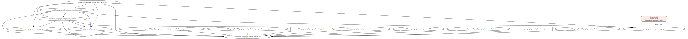

# Live (Dynamic) Diagram

The hand-drawn diagrams in [`diagrams/`](diagrams/README.md) explain the *design*. This page covers a
**generated** diagram that reflects the **actual deployed resources** and is regenerated on every
change — so it follows the infrastructure rather than the intent.

## Approach (this repo)

Cloud-side is all Terraform, so the live diagram is built **from Terraform state** with
[Inframap](https://github.com/cycloidio/inframap) + Graphviz. The on-prem side (LAN, strongSwan, VPN
peer) can't be auto-discovered by any cloud tool, so it's injected as a fixed node linked to the
external VPN gateway.

```bash
cd infra
make diagram                 # reads stacks/gcp-poc/terraform.tfstate -> docs/diagrams/live-gcp-poc.svg
make diagram STATE=stacks/aws/terraform.tfstate   # any other stack
```

Run it after any `terraform apply` and the SVG updates to match. The current output:



It shows every resource Terraform manages (hub VPC, subnets, HA VPN gateway, Cloud Router, tunnel,
firewalls, the Shared VPC spoke + VM) plus the injected **on-prem** node and its IPsec+BGP link.

## What "follows any change" can mean — the options

| Want | Tool | Covers | Update trigger |
|------|------|--------|----------------|
| From your IaC (this repo) | **Inframap** / Rover / `terraform graph` | Terraform-managed cloud + injected on-prem | re-run after `apply` (e.g. CI) |
| Actual live cloud state (incl. manual/console changes) | GCP **Cloud Asset Inventory**, AWS Config, Azure Resource Graph | one cloud each; free data, custom viz | scheduled / event |
| Turnkey continuous multi-cloud | **Hava.io**, Cloudcraft, Lucidchart import | AWS/Azure/GCP | continuous (commercial) |
| On-prem + cloud as one source of truth | **NetBox** (+ cloud sync) | model on-prem, sync cloud | on update |

**Limitations of the Inframap approach** (honest):
- Shows only what **Terraform** manages — not console/manual changes or the `default` network. For
  true drift, pair with Cloud Asset Inventory.
- On-prem is a **static** node (no auto-discovery); it's accurate because we maintain it in the script.
- Inframap's GCP connection-pruning is thin, so we use `--raw` (all resources, dependency edges).

## Automating it

**Post-apply hook (works today):**

```bash
cd infra
make apply-poc      # terraform apply gcp-poc, then regenerate the live SVG
```

This keeps the committed `live-gcp-poc.svg` in lockstep with the deployed resources — apply and the
diagram refresh in one step.

**CI-on-push (enabled):** the gcp-poc stack now uses a **GCS remote backend**
(`gs://mini-cloud-499820-tfstate`), so [`.github/workflows/diagram.yml`](../.github/workflows/diagram.yml)
regenerates the SVG on every change to `infra/**` and commits it back:

1. pulls the state from GCS, runs Inframap + Graphviz, writes `docs/diagrams/live-gcp-poc.svg`;
2. commits with `[skip ci]` (the commit touches `docs/`, not `infra/`, so it doesn't re-trigger).

**One-time setup:** add a repo secret **`GOOGLE_CREDENTIALS`** = a service-account key JSON with
**Storage Object Viewer** on the state bucket (read is enough — the diagram only pulls state). Without
the secret the job no-ops, so forks/PRs never fail.

> HCL mode (no creds) was tried and rejected: it returns an empty graph because the stack's resources
> live in `modules/` and Inframap's HCL parser doesn't expand module sources — hence the state-based job.

Tooling: `infra/diagram/gen-live-diagram.sh` + `make diagram` / `make apply-poc`. Requires `inframap`
and `graphviz`.
