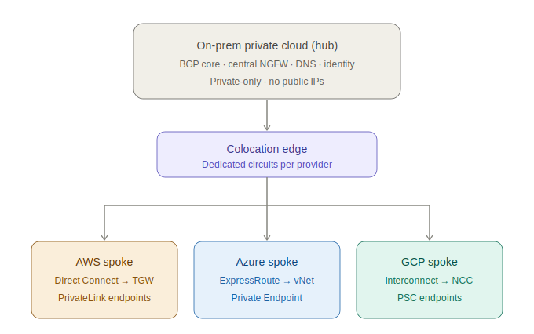
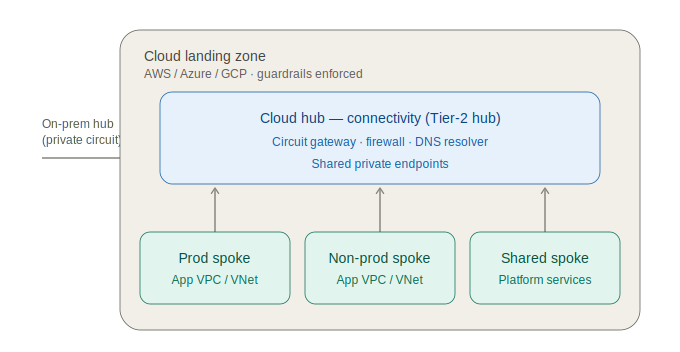
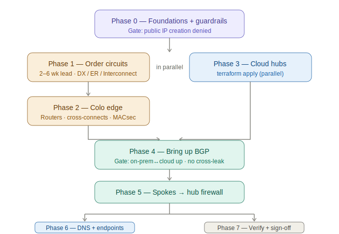
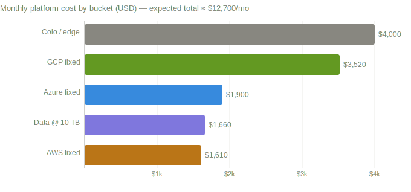

# Diagrams

Mostly self-contained SVGs (inline styling, no external assets) that render in GitHub markdown in
both light and dark mode. A few richer diagrams are HTML pages; those are linked directly and keep
a rendered text fallback in their companion doc. This is the gallery.

### 01 · Tier-1 hub-and-spoke
On-prem hub ↔ AWS/Azure/GCP spokes over dedicated private circuits. See [01 §3.1](../01-architecture-specification.md).

### 02 · Per-cloud landing zone (nested hub-and-spoke)
Inside each cloud: a cloud hub with prod/non-prod/shared workload spokes. See [01 §3.4](../01-architecture-specification.md).

### 03 · Cross-cloud east-west inspection
AWS→Azure hairpins through the on-prem NGFW, inspected three times. See [02 §4](../02-network-design.md).

### 04 · Buildout phase flow
Phase dependencies and gates from the runbook. See [06](../06-buildout-runbook.md).

### 05 · Cost breakdown
Monthly platform cost by bucket. See [07 §5](../07-cost-estimate.md).

### 06 · PoC detail — LAN ↔ GCP VPN
Full data path: strongSwan/FRR on-prem host, IPsec tunnel + eBGP over the internet, GCP HA VPN,
Cloud Router, and a private test VM. See [08 §2](../08-poc-vpn.md).

### 07 · PoC bring-up sequence
Order of operations: IKEv2 negotiation → CHILD_SA/ESP tunnel → eBGP session + route exchange →
data-plane verification. See [08 §6](../08-poc-vpn.md).

### 08 · Two-plane IPAM
Private plane (`10.0.0.0/8`, cloud-local) vs cross-cloud plane (`172.16.0.0/12`, spoke-to-spoke),
per-site allocations. See [02 §1](../02-network-design.md).

### 09 · Live GCP PoC (generated)
Auto-generated from Terraform state (Inframap + Graphviz), refreshed by CI on every `infra/**`
change. See [09](../09-live-diagram.md).

### 10 · Lakehouse architecture (interactive HTML)
GCS storage layer + BigLake Iceberg REST runtime catalog, feeder/consumer access model. Interactive
SVG — open [gcp-lakehouse-architecture.html](gcp-lakehouse-architecture.html) directly. See
[10](../10-lakehouse-poc.md).
